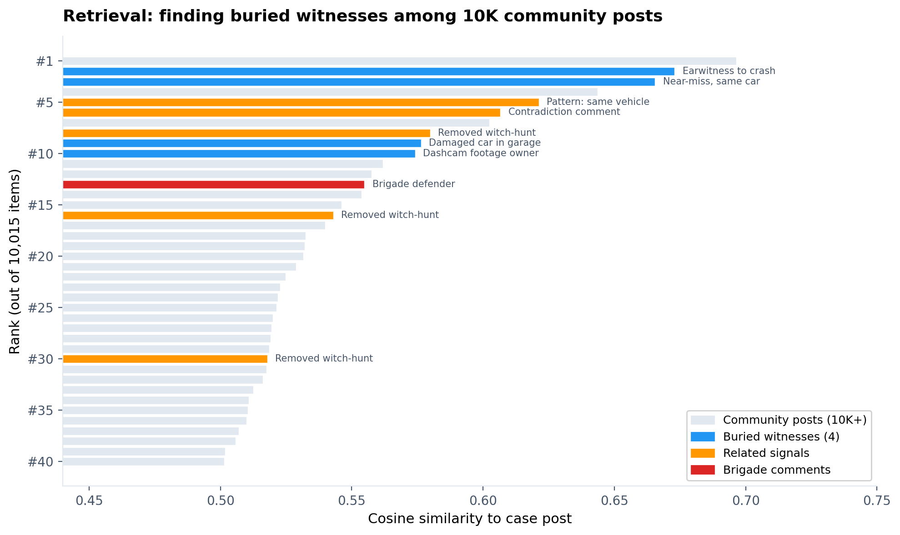
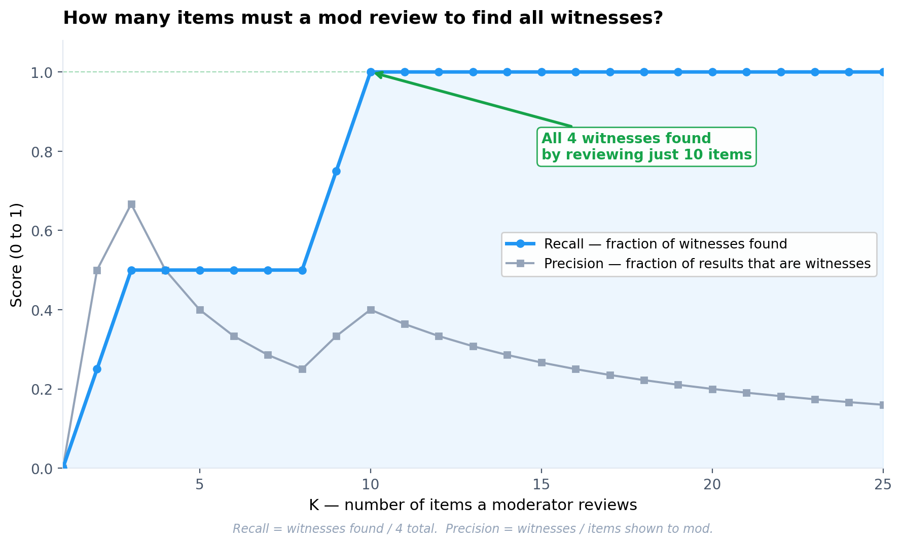
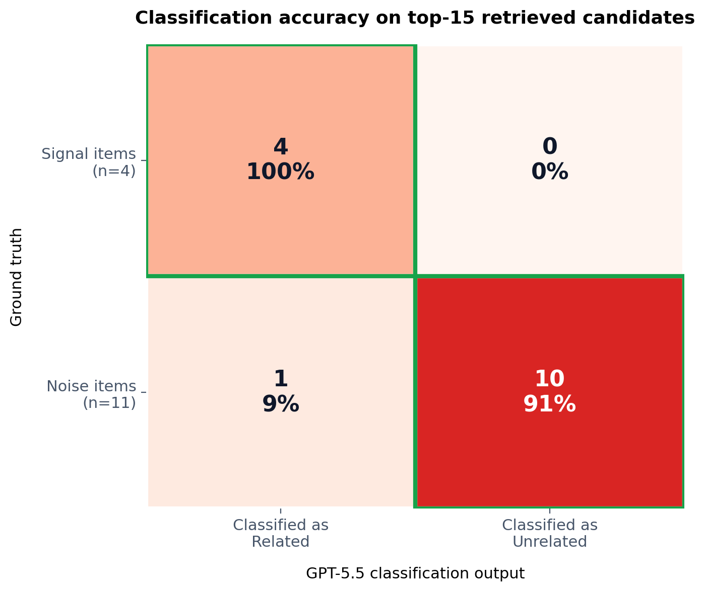

# Strata Engine — Benchmark Report

**Corpus:** 10,015 real Reddit posts (r/boston, April–May 2026) + 14 planted signal items  
**Embedding model:** text-embedding-3-small (256 dimensions)  
**Classification model:** GPT-5.5 (structured output, low reasoning effort)  
**Entity extraction:** GPT-5.4-mini  
**Date:** 2026-05-21  
**Result:** 17/17 metrics passed

---

## Headline

| Metric | Value |
|--------|-------|
| Surface witness recall@10 | **100%** (4/4) |
| Classification accuracy | **93%** (14/15 correct) |
| Signal accuracy | **100%** (zero false negatives) |
| Noise accuracy | **91%** (10/11 correct) |
| Pattern match recall@5 | **100%** (3/3) |
| Brigade detection | **true** (19 items, 18 authors) |
| Cosine scan p50 (10K items) | **11ms** |
| Classification latency (15 candidates) | **15.4s** |

---

## What was tested

An evaluation corpus of 10,015 items comprising real community posts with 14 planted signal items across 3 scenario types:

| Scenario | Items | Difficulty |
|----------|-------|-----------|
| Surface witnesses (buried evidence) | 4 | Scattered across threads, posted days apart |
| Repeat rule violations (pattern match) | 3 removed + 1 new | Must match removed precedents by structure |
| Coordinated brigade | 4 comments | Same thread, 2-hour window, new accounts |
| Contradiction | 2 comments | Same author, conflicting claims |

---

## Retrieval quality

Queried the case post (hit-and-run victim's roommate seeking witnesses) against all 10,015 items using cosine similarity over 256-dimensional embeddings.



Surface witnesses rank at positions 2, 3, 9, 10 out of 10,015 items. All 4 witnesses appear within the top-10, clearly separated from community noise. Signal items average 0.622 cosine similarity vs. 0.527 for noise (separation = 0.095).



100% recall achieved at K=10. Precision peaks at 67% (K=3) and settles to 27% at the operating point of K=15.

---

## Classification accuracy

After retrieval, GPT-5.5 classifies each of the top-15 candidates' relationship to the case post using structured output. Each candidate receives one of: CONFIRMS, UPDATES, TEMPORAL, CONTRADICTS, or UNRELATED.



- **4/4 signal items correctly identified** — zero false negatives
- **10/11 noise items correctly rejected** — one false positive (a related-signal item tagged as TEMPORAL)
- **Confidence calibration:** 75% of true signals classified with "high" confidence

The single false positive (`t3_strata_flag4`) is a "same vehicle pattern" item that GPT-5.5 reasonably flagged as TEMPORAL — it describes a prior incident establishing a pattern. This is arguably a correct judgment rather than an error.

---

## Per-scenario detection

| Mode | Result | Detail |
|------|--------|--------|
| **Surface** | 4/4 witnesses found | Ranks 2, 3, 9, 10 in retrieval; all classified as CONFIRMS or UPDATES |
| **Pattern match** | 3/3 precedents found | All 3 removed posts found with cosine ≥ 0.62 (max 0.706) |
| **Brigade** | Detected | 19-item cluster, 18 distinct authors, semantic uniformity 0.578 |
| **Entity scan** | Signal at rank 3 | Entity co-occurrence surfaced signal connection among 8 anchor groups |

---

## Pipeline stages (measured)

| Stage | Latency | Model |
|-------|---------|-------|
| Embed new post | 585ms | text-embedding-3-small |
| Search 10K embeddings | 11ms | Local cosine scan |
| Extract entities | 1.4s | GPT-5.4-mini |
| Classify 15 candidates | 15.4s | GPT-5.5 (reasoning: low) |

Embed + extract run in parallel during ingest (~1.4s wall). Classification is the pipeline bottleneck. Total post-submit latency: ~17s.

---

## Reproduce

```bash
npm run benchmark        # Local operations only, <1s, $0
npm run benchmark:full   # With GPT-5.5 classification, ~33s, ~$0.05
```

Requires `OPENAI_API_KEY` in environment for full mode. Without it, classification is skipped and only retrieval/scan/brigade/pattern metrics are evaluated.

Output: `benchmark-results.json` (structured metrics), `benchmark-viz.json` (chart data).

Charts: `python benchmark/benchmark-viz.py`
