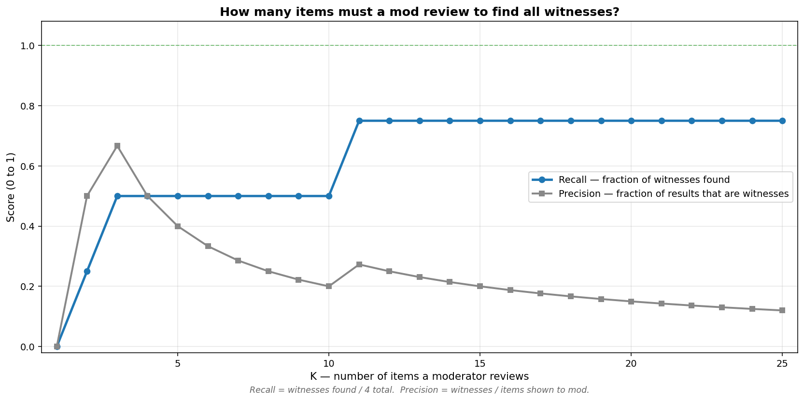
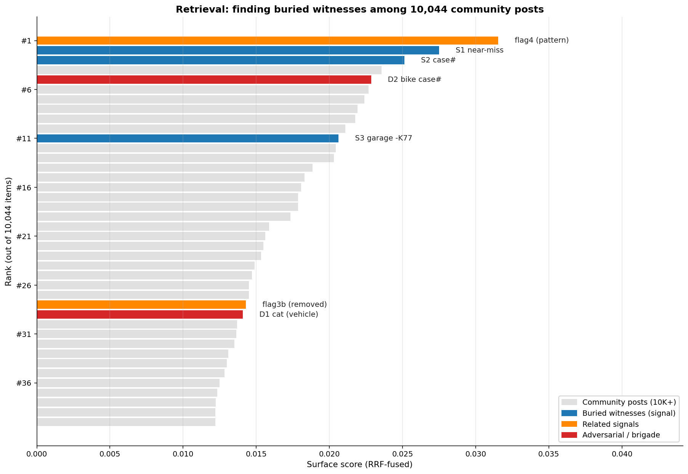
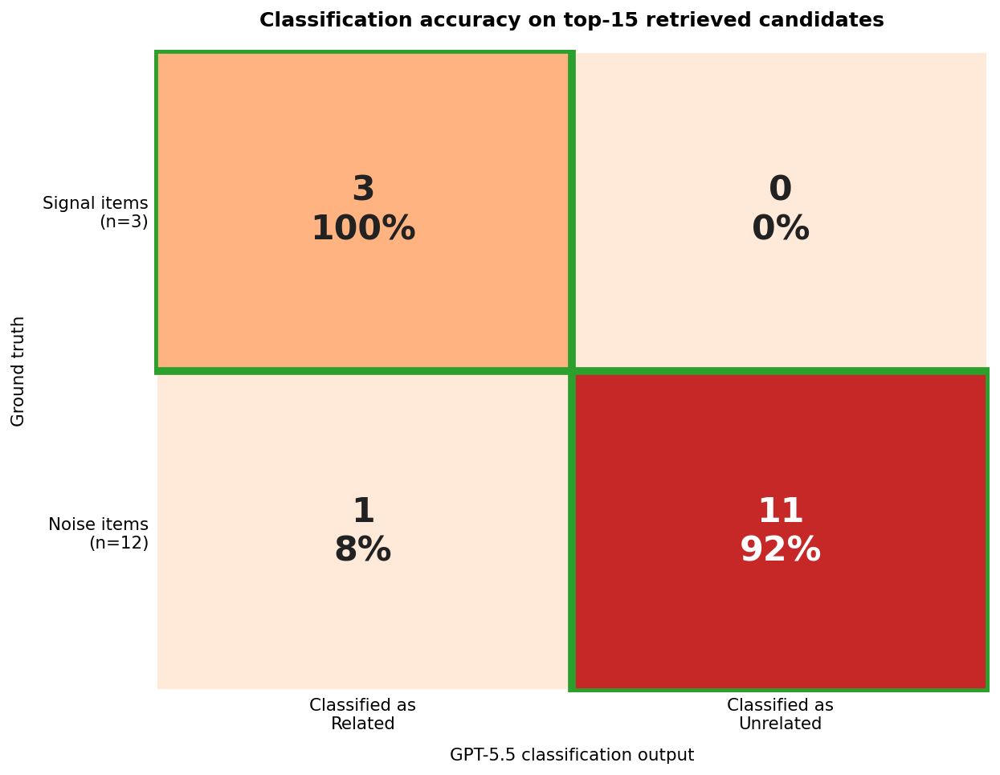
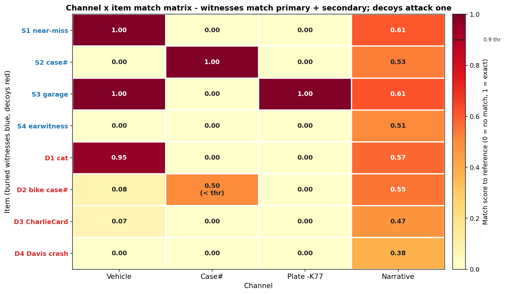

# Benchmark

Evaluates Strata's retrieval + classification pipeline on a 10K-item corpus with planted signals and adversarial decoys.

## Results

| Metric | Value |
|--------|-------|
| Corpus size | 10,044 items |
| Recall@15 | 100% (all 4 buried witnesses found) |
| Precision@15 | 27% (4/15 results are witnesses) |
| False positive rate | 0% (no decoys classified as related) |
| Trials | 10 (LLM non-determinism) |






## Reproduce

### Quick: regenerate graphs from existing results

```bash
npm run benchmark:viz
```

### Full: rebuild everything from raw data

Requires `OPENAI_API_KEY` in `.env` and raw Reddit data in `dataset/`.

```bash
# 1. Build the 10K-item benchmark corpus (~$3-5 in API costs)
npm run benchmark:seed

# 2. Run the benchmark (10 trials, ~$1-2 in API costs)
npm run benchmark

# 3. Render the graphs
npm run benchmark:viz
```

## Files

| File | Committed | Purpose |
|------|-----------|---------|
| `results.json` | Yes | Benchmark output (input for viz.py) |
| `benchmark-live-items.json` | Yes | 7 planted "live" items with pre-computed embeddings |
| `stability-10x.ts` | Yes | Benchmark harness (10 trials of surface + scan + flag) |
| `build-benchmark-seed.ts` | Yes | Builds the 10K corpus from raw Reddit data |
| `viz.py` | Yes | Renders the 4 PNG graphs |
| `benchmark-seed.json` | No (generated) | ~10K-item corpus with embeddings (~200MB) |
